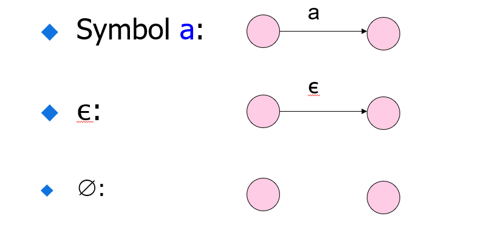
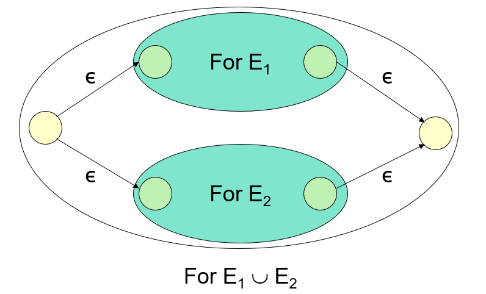
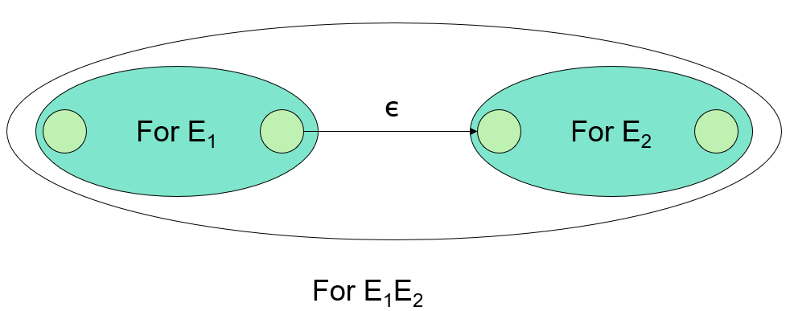
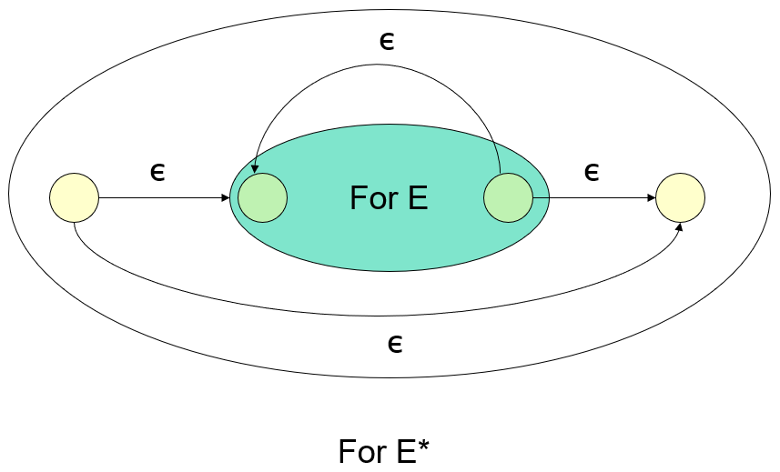

### 第二章 有穷自动机

#### 1. 确定型有穷自动机 DFA

##### 定义：$A=(Q,\Sigma,\delta,q_0,F)$

1. $Q$：有穷的状态集合
2. $\Sigma$：输入符号集合
3. $\delta$：转移函数 $\delta(q,a)=p$
4. $q_0$：初始状态
5. $F$：终结状态或接收状态集合

##### 拓展转移函数：$\delta^\Lambda(q,a)$ （本来应该将倒三角放在正上方）

1. 基础：$\delta^\Lambda(q,\epsilon)=q$
2. 归纳：$w=xa=>\delta^\Lambda(q,w)=\delta(\delta^\Lambda(q,x),a)$

##### DFA语言

$L(A)=\{w|\delta^\Lambda(q_0,w)\in F\}$

#### 2.非确定型有穷自动机 NFA

##### 定义：与有穷自动机相同 不过 $\delta$ 返回一个转移状态集合

##### 拓展转移函数：

若$w=xa$且$\delta^\Lambda(q,x)=\{p_1...p_k\}$

则$\delta^\Lambda(q,w)=\bigcup_{i=1}^{k}\delta(p_i,a)$

##### NFA语言

$L(A)=\{w|\delta^\Lambda(q_0,w) \bigcap F \neq \emptyset\}$

#### 3.DFA与NFA的等价性

 - $DFA\rightarrow NFA$

   只需要将单个状态转换位集合即可

 - $NFA \rightarrow DFA$

   将状态变为NFA子集合（将每个子集看作一个整体）

对每一个集合$S\in Q_N$ 以及$\sum$ 中每个符号 $a$ 有：

$\delta_D(S,a)=\bigcup_{p \in S}\delta_N(p,a)$ 具体证明见PDF中文版P56

#### 4.带$\epsilon$转移的自动机（接受$\epsilon$的NFA）

##### $\epsilon$闭包：

**ECLOSE(q)**: q和所有从q开始$\epsilon$转移所达到的状态

##### $\epsilon-NFA \Rightarrow DFA$

1. 设 $E=NFA(Q_E,\sum,\delta_E,q_0,F_E)$ ,$D=DFA(Q_D,\sum,\delta_D,q_D,F_D)$
2. $Q_D$是$Q_E$子集的集合
3. $q_D=ECLOSE(q_0)$
4. $F_D=\{S|S\in Q_D \& S \bigcap F_E \neq \emptyset\}$
5. 定义$\delta_D(s,a)$
   - $s = \{p_1...p_k\}$
   - $\bigcup_{i=1}^k \delta_E(p_i,a)\Rightarrow\{r_1...r_m\}$
   - $\delta_D(s,a)=\bigcup_{j=1}^m ECLOSE(r_j)$

> 一个语言是正则的当且仅当它被一个DFA接受

### 第三章 正则表达式和正则语言

1. 语言运算：并，连接，克林闭包（*运算）

2. 正则表达式的定义：

   1. $\epsilon$ 和 $\emptyset$ 是正则表达式

   2. a 是任意符号，a 是正则表达式

   3. 定义L，任意语言

   4. 有以下归纳：

      $L(E+F)=L(E)\bigcup L(F)$

      $L(EF)=L(E)L(F)$

      $L(E^*)=(L(E))^*$

      $L(E)=L(E)$

3. 语言类有两个重要特性：决定性和封闭性

4. 判断正则语言的无穷性：

   只要有在$[n,2n-1]$长度的字符串被接受（n 为状态个数）

5. 正则语言的泵引理：（可用于判断一个语言不是正则语言 必要条件）

   存在一个数 n 对任意的字符串 w，$|w|>=n$，可以表示为$w=xyz$满足

   - $|xy|<=n$
   - $|y|>0$
   - 对$i>=0$ 有$xy^iz \in L$

6. 乘积DFA（product DFA）：
   - 对两个状态集为Q和R的DFA L和M，构造新DFA状态为QXR （笛卡尔积）
   - 有状态转移函数：$\delta([q,r],a)=[\delta_L(q,a),\delta_M(r,a)]$

7. 判断两个DFA是否相等：

   构造Product DFA，结束状态为只含有一个DFA的结束状态积，如果他的语言是空，则DFA相等

8. 判断DFA之间的包含性：

   判断 L<=M，构造结束状态为$[q,r]$的 Product DFA（q是L的结束状态，r是M的），如果为空则成立

9. 最小化DFA：
   - 标记所有只包含一个结束状态的状态积，如果$[\delta(q,a),\delta(r,a)]$被标记，标记[q, r]
   - 把所有不可区分状态合并为1个状态

10. 闭包性：

    合并，连接，星运算上，交集，差，补，反转，同态，逆同态封闭

11. 代数定律：

    - $\emptyset是并运算的幺元$
    - $\epsilon是连接运算的幺元$
    - $\emptyset是连接运算的零元$

12. RE与DFA转换：

12. DFA 到RE转换：
    - 首先将所有状态从1开始编号
    - 定义K-Path 为满足从 i 到 j 的经过的状态不超过K的串 表示为:$R_{ij}^k$
    - 定义运算 $R_{ij}^k=R_{ij}^{k-1}+R_{ik}^{k-1}(R_{kk}^{k-1})R_{kj}^{k-1}$
    - 那么$R_{ij}^n$就是最后结果其中n为状态数，i为开始状态，j为结束状态

### 第五章 上下文无关文法

1. 表示：

   $CFG=(V,T,P,S)$ V是变元，T是终结符号，P是产生式，S初始符号

2. BNF范式：略
3. 最左最右推导
4. 语法分析树：产生式为叶节点从左到右依次连起来
5. 语法歧义性：对一个串有多个分析树（多个最左推导）
6. 平衡括号的无歧义表达：$B\rightarrow(RB|\epsilon$ ; $R\rightarrow )|(RR$
7. 固有歧义(inhert ambiguity)：和文法无关属于语言本身的歧义性
8. CFL范式：去除无用变量，去除$\epsilon$，去除单位产生式；步骤：去除$\epsilon$，去除单位，去除无用
9. 去除无用变元：
   - 找到能够产生终结符的变元
   - 除去未找到的
   - 删除不能到达的变元

10. 去除$\epsilon$产生式
    - $A\rightarrow \epsilon$ : A是空的
    - $A\rightarrow \alpha$ : $\alpha$是空的 A是空的
    - 将产生式变为可空变元$2^m$个（幂集）,删除其中完全为空的产生式 

11. 去除单位产生式：
    - (A, A) 是单位
    - 如果（A，B）是单位而且B->C那么（A，C）是单位

12. CNF：产生式只能有两种形式: $A\rightarrow BC$或$A\rightarrow a$

### 第六章 下推自动机

